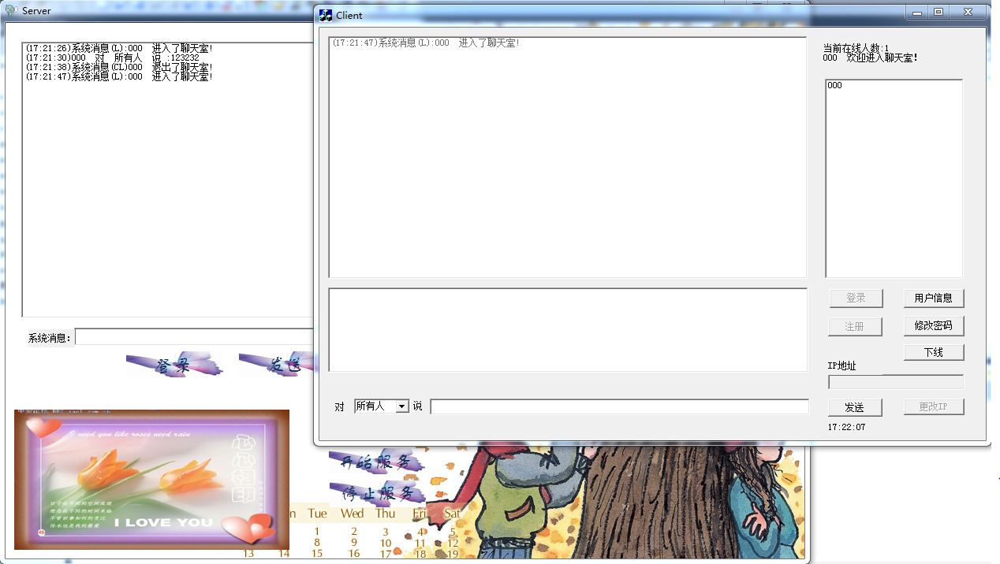

ui：  
http://www.codesc.net/source/1290.shtml

VC++课程设计：C/S结构聊天程序源码实例
C/S结构的网络聊天程序，VC++源码实现，带文档的课程设计资料，通过本聊天程序你可以： 
　　（1）.深入了解了，TCP 传递消息的机制。 
　　（2）熟悉了MFC 大概的使用方法，但是只是最基础的，对MFC编程还存在很大的问题。 
　　（3）对ActiveX控键产生很大的兴趣，还有com .有意学习这个技术，并运用到萌芽基金项目上面。 
　　程序测试说明： 
　　server端： 
　　1. 先登陆：帐号密码已经设置好，直接登陆（别改端口号） 
　　2.开始服务 
　　3.终止服务 
　　注意：如果是点debug文件夹下面的exe执行，要把客户信息文件包含就去（user.dat 在文件包里面） 
　　Client 端： 
　　1.登陆（登陆信息可以在server上注册，不可以在服务器上，没实现功能） 
　　设置好帐号：hupeng 1988822 (心海红帆) 
　　 jianghe 1988822（江河） 
　　2.未实现密码修改

